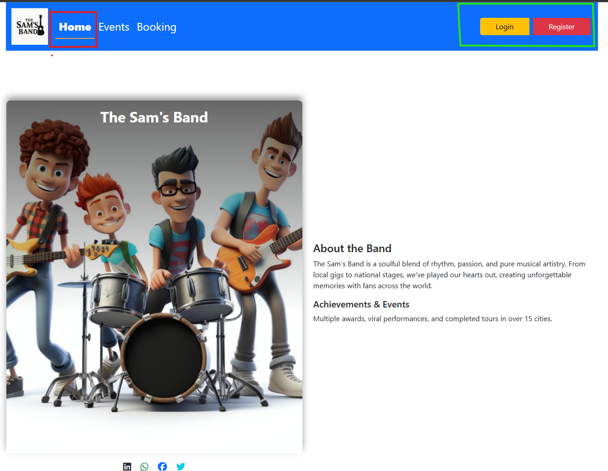
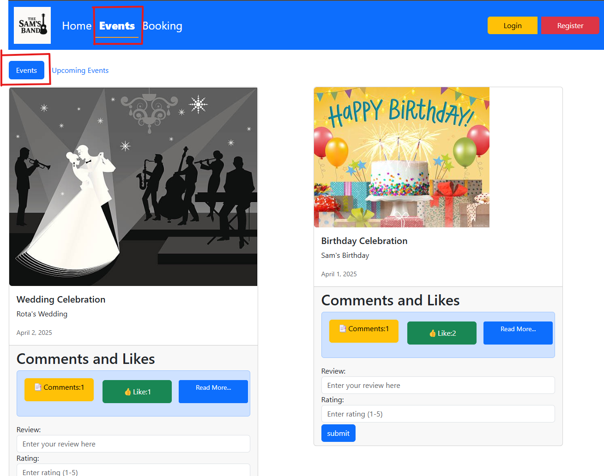
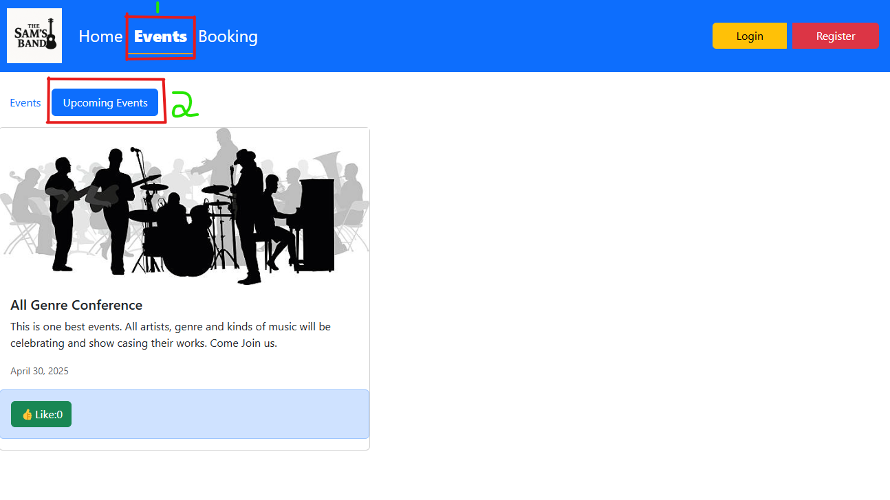

# 🎸 Fictional Band App

## 📌 Description

Fictional Band is a Django web application for "Sam's Band" that showcases the band's journey, awards, previous events, and upcoming shows. Users can interact by commenting, rating, and booking the band for events.

---

## 📚 Table of Contents

- [Description](#-description)
- [Installation](#-installation)
- [Usage](#-usage)
- [Features](#-features)
- [Project Structure](#-project-structure)
- [Tech Stack](#-tech-stack)
- [Environment Variables](#-environment-variables)
- [Docker](#-docker)
- [Git Ignore](#-git-ignore)
- [Credits](#-credits)

---

## 🛠 Installation

### 🔧 Local Setup with Pipenv

1. **Clone the repository:**

```bash
git clone https://github.com/Samoel33/fictional_band_v2.git
cd fictional_band
```

2. **Install dependencies and activate the environment:**

```bash
pipenv install
pipenv shell
```

or

```bash
pip install -r requirements.txt
```

3. **Apply migrations:**

```bash
python manage.py migrate
```

4. **Run the development server:**

```bash
python manage.py runserver
```

Visit [http://127.0.0.1:8000](http://127.0.0.1:8000) to view the app.

---

## ▶️ Usage

- Visit the homepage to learn about the band.
- Navigate to "Events" → "Past Events" or "Upcoming Events".
- Register/Login to comment or book the band.
- Bookings require login and can be viewed under "My Bookings".
- Like/unlike events and submit comments and ratings.
- All data is stored in a local SQLite database.

---

## ✨ Features

- ✅ User registration and login
- ✅ Comment and like past events
- ✅ View past and upcoming events
- ✅ Book the band for an event
- ✅ Track your bookings and their status
- ✅ Responsive UI with Bootstrap
- ✅ Uses Django ORM and SQLite for storage

---

## 🧱 Project Structure

```
fictional_band/
├── auth_app/
│   └── templates/
├── band_app/
│   └── templates/
├── fictional_band/
├── event_images/
├── static/
├── screenshots/
├── db.sqlite3
├── manage.py
├── Pipfile
├── Pipfile.lock
├── requirements.txt
├── .env               # (not committed)
└── Procfile
```

---

## 🧰 Tech Stack

- Python 3.13
- Django 4.2.20
- SQLite
- HTML5, CSS3, Bootstrap 5
- JavaScript (for interactivity)
- Docker 
- Pipenv for dependency management

---

## 🔐 Environment Variables

Create a `.env` file in the project root with the following:

```env
SECRET_KEY=your-django-secret-key
DEBUG=True
```

In your `settings.py`, use:

```python
from decouple import config

SECRET_KEY = config('SECRET_KEY')
DEBUG = config('DEBUG', default=False, cast=bool)
```

---

## 🐳 Docker (Optional)

If you prefer Docker:

🛠 Prerequisites
Docker installed on your machine.

1. Make sure you have a valid `Dockerfile`.
2. docker build -t fictional-band .
3. docker run -p 8000:8000 fictional-band

🌐 Access the App
Once the container is running, visit:
Visit: [http://localhost:8000](http://localhost:8000)

---

## 📄 .gitignore (Important)

```
# Python
__pycache__/
*.py[cod]
*.sqlite3
*.log

# Pipenv
Pipfile.lock

# Environment
.env
.env.*

# Virtual Environments (just in case)
env/
venv/

# VSCode
.vscode/
```

---

## 📸 Screenshots

  
  


---

## 👥 Credits

Project developed by:

- [Samoel Seshoka](https://github.com/Samoel33)
